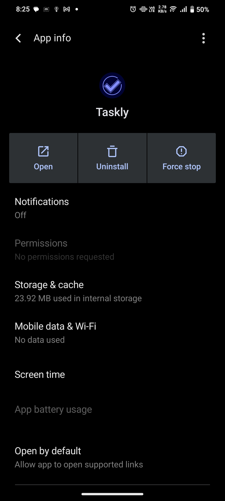

## Created with Capacitor Create App

This app was created using [`@capacitor/create-app`](https://github.com/ionic-team/create-capacitor-app),
and comes with a very minimal shell for building an app.

### Running this example

To run the provided example, you can use `npm start` command.

```bash
npm start
```



